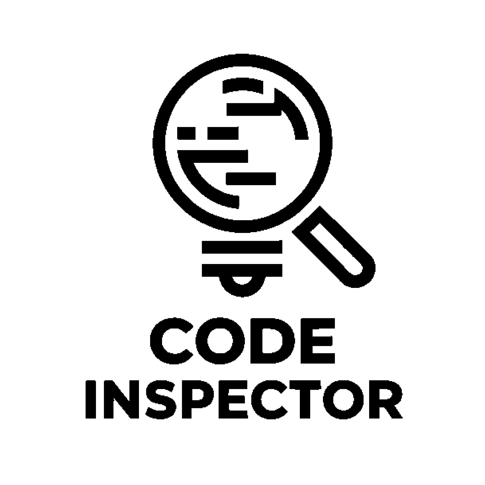

# Code Inspector

<div align="center">
  
  <br>
  <p><strong>A Modern Code Analysis and Quality Inspection Tool with AI Capabilities</strong></p>
  <p><a href="https://codeinspector.vercel.app" target="_blank">codeinspector.vercel.app</a></p>
</div>

## 🌟 Overview

Code Inspector is a sophisticated code analysis tool designed to help developers maintain high-quality code standards. It combines frontend visualization with powerful backend analysis to provide comprehensive insights into your codebase.

## 🚀 Features

- **Code Quality Analysis**: Automated inspection of code quality using PMD
- **Duplicate Code Detection**: Identifies code duplications and suggests improvements
- **AST Visualization**: Interactive visualization of Abstract Syntax Trees
- **Real-time Analysis**: Instant feedback on code quality
- **Modern UI**: Built with React and Tailwind CSS for a seamless user experience
- **AI-Powered Test Generator**: Automated Test Generation with Gemini AI

## 🛠️ Tech Stack

### Frontend
- React 18
- TypeScript
- Tailwind CSS
- Vite
- React Flow for graph representations
- Shadcn Components
- Gemini AI integration

### Backend
- Java 21
- Spring Boot 3
- PMD for code analysis
- Tree-sitter Java
- JUnit for testing
- Maven
- Jococo for code coverage

## 🏗️ Architecture

The project follows a modern client-server architecture:
- **Frontend**: Single Page Application (SPA) built with React
- **Backend**: RESTful API built with Spring Boot
- **Analysis Engine**: Combines PMD and custom analysis tools
**AI Layer**: Integrates Gemini AI for intelligent code analysis

## 🚦 Getting Started

### Prerequisites
- Node.js (v18 or higher)
- Java 21
- Maven
- Gemini API Key (for AI features)

### Frontend Setup
```bash
cd code-inspector
npm install
npm run dev
```

### Backend Setup
```bash
cd CodeInspectorBackend
mvn clean install
mvn spring-boot:run
```

## 🧪 Testing

### Frontend Tests
```bash
cd code-inspector
npm test
```

### Backend Tests
```bash
cd CodeInspectorBackend
mvn test
```

## 📈 Quality Metrics

The project uses several tools to maintain code quality:
- SonarQube for continuous code quality
- PMD for Java code analysis
- JaCoCo for test coverage analysis

## 🤝 Contributing

We welcome contributions! Please feel free to submit a Pull Request.

## 📝 License

This project is licensed under the MIT License - see the LICENSE file for details.

## 👥 Team

- Developed by the Code Inspector Team
- Maintained by [@Blldlgc](https://github.com/blldlgc) (Bilal Dalgıç) & [@Btlsn](https://github.com/Btlsn)  (Betül Şen)

## 📞 Contact

For any queries or support, please open an issue in the repository.

## 🌐 Application

The full version of Code Inspector is available at [codeinspector.vercel.app](https://codeinspector.vercel.app).

---

<div align="center">
  Made with ❤️ by Code Inspector Team
</div> 
